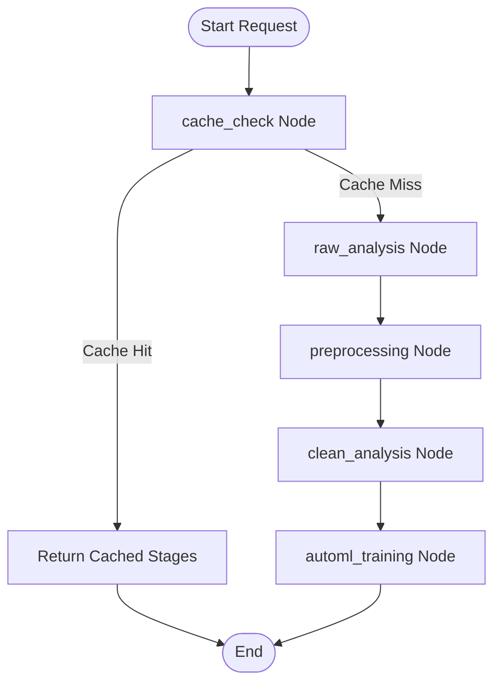
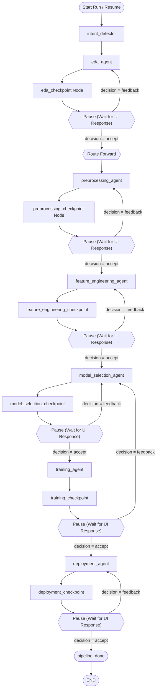

# Data-to-Deployment (DTD) Multi‑Agent AutoML Pipeline

## Introduction
The DTD AutoML platform provides an end‑to‑end machine‑learning pipeline that can operate **statically** (fully automated) or **dynamically** (human‑in‑the‑loop). It orchestrates a collection of specialized agents to perform exploratory data analysis, preprocessing, feature engineering, model training, and deployment.

## Features
- **Static Pipeline** – Run the entire workflow without user interaction; results are stored under `Outputs/static`.
- **Dynamic Pipeline** – Interactive mode where a user can review and modify each stage via the `ControllerAgent`.
- **Modular Agent Design** – Each step is encapsulated in an agent (EDA, Preprocessing, Feature Engineering, Model Training, Deployment).
- **Caching & Persistence** – Automatic caching of intermediate results and MongoDB‑backed state persistence for resumable runs.
- **REST API** – Programmatic access to both pipeline modes.

## Architecture
The system is organised into three layers:

1. **API & Orchestration Layer** – `api.py` handles HTTP endpoints, session persistence, and streams progress.
2. **Agent Orchestration** – `orchestrator.py` (static) and `controller_agent.py` (dynamic) coordinate agents using **LangGraph** state graphs.
3. **Tool & Engine Execution** – Agents execute actual data processing and machine‑learning tasks using libraries such as scikit‑learn, Optuna, AutoGluon, etc.

### Static Pipeline


### Dynamic Pipeline


## Input / Output
- **Input** – A raw dataset (e.g., `Titanic‑Dataset.csv`) placed in the `uploads/` directory.
- **Outputs** – EDA reports, preprocessing logs, feature importance files, trained model artifacts (`model.pkl`, `metrics.json`), and a deployment package.  
  - Static mode stores all artifacts under `Outputs/static`.  
  - Dynamic mode stores artifacts under `Outputs/dynamic` with timestamps.

## API Endpoints
| Method | Endpoint | Description |
|--------|----------|-------------|
| `POST` | `/suggest-target` | Suggest target column and problem type. |
| `POST` | `/run-pipeline/{dataset_id}/{report_id}` | Execute static pipeline (SSE streaming). |
| `POST` | `/dynamic/run/{report_id}` | Initialise dynamic pipeline. |
| `POST` | `/dynamic/resume/{run_id}` | Submit user decision/feedback to resume. |
| `GET`  | `/dynamic/status/{run_id}` | Retrieve current pipeline status. |

## Project Structure
```
GP code/
├─ agents/
│   ├─ static/
│   └─ dynamic/
├─ api.py
├─ orchestrator.py
├─ docs/ – detailed design documents (architecture.md, etc.)
├─ Output/
│   ├─ static/
│   └─ dynamic/
├─ tests/
└─ README.md
```

## Contributing
Contributions are welcome! Please fork the repository, create a feature branch, and submit a pull request.

## Website
<a href="https://github.com/ahany42/DTD-Website">Github Repos</a>

## Team Members
- Haneen Akram Ahmed
- Reem Ahmed Ismail
- Aly Hany
- Raghad Rafat
- Mohamed Ashraf
- Zeina Shawkat
