# Dynamic ML Pipeline — Architecture Documentation

> **Stack:** Python · LangGraph `StateGraph` · LangChain tools · MemorySaver checkpointer  
> **Pattern:** Sequential multi-agent pipeline with per-agent Human-in-the-Loop (HITL) interrupts  
> **Entry point:** `graph/graph_builder.py → build_graph()`  
> **State bus:** `state/pipeline_state.py → PipelineState`

---

## 1. High-Level Flow

```mermaid
flowchart TD
    Start([User: Dataset Path + NL Query]) --> ID

    ID["🔍 Agent 0 — Intent Detector\nintent_detector_node\n─────────────────────────\n• Extracts schema via schema_extractor\n• Suggests target via target_suggester\n• Emits IntentFlags JSON\n• Sets: intent_flags, target_column, task_type"]

    ID -->|route_after_intent| EDA_Gate

    subgraph PIPELINE["Dynamic Pipeline — nodes activated by intent_flags"]
        direction TB

        %% ── EDA ──────────────────────────────────────────
        EDA_Gate{{"run_eda?"}}
        EDA_Gate -->|Yes| EDA
        EDA_Gate -->|No — skip| Pre_Gate

        EDA["📊 Agent 1 — EDA Agent\neda_node\n─────────────────────────\n• data_understanding (profiling)\n• eda_tools (statistics, anomaly)\n• eda_plots (visualisations)\n• Writes: analysis_report_path\n  visualization_paths\n  preprocessing_context\n  automl_directives"]

        EDA --> EDA_CK

        EDA_CK{{"HITL Checkpoint\neda_checkpoint_node\ninterrupt() → user reviews"}}
        EDA_CK -->|accept| Pre_Gate
        EDA_CK -->|feedback → re-run| EDA

        %% ── Preprocessing ────────────────────────────────
        Pre_Gate{{"run_preprocessing?"}}
        Pre_Gate -->|Yes| PRE
        Pre_Gate -->|No — skip| FE_Gate

        PRE["🧹 Agent 2 — Preprocessing Agent\npreprocessing_node\n─────────────────────────\n• preprocessing_plan  (LLM strategy)\n• preprocessing_missing_values\n• preprocessing_outliers\n• preprocessing_encoding\n• preprocessing_scaling\n• preprocessing_balancing\n• preprocessing_split  (train/test)\n• preprocessing_validation\n• Writes: clean_data_path\n  X_train_path · X_test_path\n  y_train_path · y_test_path\n  preprocessing_summary"]

        PRE --> PRE_CK

        PRE_CK{{"HITL Checkpoint\npreprocessing_checkpoint_node\ninterrupt() → user reviews"}}
        PRE_CK -->|accept| FE_Gate
        PRE_CK -->|feedback → re-run| PRE

        %% ── Feature Engineering ──────────────────────────
        FE_Gate{{"run_feature_engineering?"}}
        FE_Gate -->|Yes| FE
        FE_Gate -->|No — skip| MS_Gate

        FE["⚙️ Agent 3 — Feature Engineering Agent\nfeature_engineering_node\n─────────────────────────\n• feature_engineering_execution\n  (transforms, selection, creation)\n• Writes: X_train_engineered_path\n  X_test_engineered_path\n  feature_report\n\n[STUB — real impl pending]"]

        FE --> FE_CK

        FE_CK{{"HITL Checkpoint\nfeature_engineering_checkpoint\ninterrupt() → user reviews"}}
        FE_CK -->|accept| MS_Gate
        FE_CK -->|feedback → re-run| FE

        %% ── Model Selection ──────────────────────────────
        MS_Gate{{"run_model_selection?"}}
        MS_Gate -->|Yes| MS
        MS_Gate -->|No — skip| TR_Gate

        MS["🧠 Agent 4 — Model Selection Agent\nmodel_selection_node\n─────────────────────────\n• model_selection  (nodes/model_selection.py)\n• plan_training  (LLM strategy + tool calls)\n• Selects: algorithm family, hyperparams\n• Writes: automl_config\n  model_selection_reasoning\n  training_plan · user_preferences"]

        MS --> MS_CK

        MS_CK{{"HITL Checkpoint\nmodel_selection_checkpoint_node\ninterrupt() → user reviews"}}
        MS_CK -->|accept| TR_Gate
        MS_CK -->|feedback → re-run| MS

        %% ── Training ─────────────────────────────────────
        TR_Gate{{"run_training?"}}
        TR_Gate -->|Yes| TR
        TR_Gate -->|No — skip| EV_Gate

        TR["🚀 Agent 5 — Training Agent\ntraining_node\n─────────────────────────\n• Reads training_plan from state\n• Dispatches to engine:\n  ├─ train_simple  (sklearn/XGBoost)\n  ├─ train_simple_optuna  (HPO)\n  └─ train_autogluon  (AutoML)\n• Writes: trained_model_path\n  training_log · model_leaderboard"]

        TR --> TR_CK

        TR_CK{{"HITL Checkpoint\ntraining_checkpoint_node\ninterrupt() → user reviews"}}
        TR_CK -->|accept| EV_Gate
        TR_CK -->|feedback → re-run| TR

        %% ── Evaluation ───────────────────────────────────
        EV_Gate{{"run_evaluation?"}}
        EV_Gate -->|Yes| EV
        EV_Gate -->|No — skip| DEP_Gate

        EV["📈 Agent 6 — Evaluation Agent\nevaluation_node\n─────────────────────────\n• evaluate.py  (metrics computation)\n• SHAP · confusion matrix · ROC\n• Writes: model_metrics\n  shap_plot_path · diagnostic_report\n  confusion_matrix_path · roc_curve_path"]

        EV --> EV_CK

        EV_CK{{"HITL Checkpoint\nevaluation_checkpoint_node\ninterrupt() → user reviews"}}
        EV_CK -->|accept| DEP_Gate
        EV_CK -->|feedback → re-run| EV

        %% ── Deployment ───────────────────────────────────
        DEP_Gate{{"run_deployment?"}}
        DEP_Gate -->|Yes| DEP
        DEP_Gate -->|No — skip| DONE

        DEP["☁️ Agent 7 — Deployment Agent\ndeployment_node\n─────────────────────────\n• Package model artifacts\n• Register in MLflow\n• Expose endpoint\n• Writes: deployment_package_path\n  mlflow_run_id · endpoint_url\n\n[STUB — real impl pending]"]

        DEP --> DEP_CK

        DEP_CK{{"HITL Checkpoint\ndeployment_checkpoint_node\ninterrupt() → user reviews"}}
        DEP_CK -->|accept| DONE
        DEP_CK -->|feedback → re-run| DEP
    end

    DONE(["✅ pipeline_done_node\nSummarises: task_type · target\ntrained_model_path · endpoint_url"])
    DONE --> END([END])
```



---

## 2. Core Infrastructure

### 2.1 Global State Bus — `PipelineState`
**File:** [`state/pipeline_state.py`](../state/pipeline_state.py)

Every agent reads from and writes to a single shared `TypedDict`. No agent imports another agent — the state is the only communication channel.

| Section | Key Fields | Written By |
|---|---|---|
| **Inputs** | `data_path`, `nl_query` | Caller |
| **Intent** | `intent_flags`, `target_column`, `task_type` | Agent 0 |
| **EDA** | `analysis_report_path`, `visualization_paths`, `preprocessing_context`, `automl_directives` | Agent 1 |
| **Preprocessing** | `clean_data_path`, `X/y_train/test_path`, `preprocessing_summary` | Agent 2 |
| **Feature Engineering** | `X/y_train/test_engineered_path`, `feature_report` | Agent 3 |
| **Model Selection** | `automl_config`, `model_selection_reasoning`, `training_plan`, `user_preferences` | Agent 4 |
| **Training** | `trained_model_path`, `training_log`, `model_leaderboard` | Agent 5 |
| **Evaluation** | `model_metrics`, `shap_plot_path`, `diagnostic_report`, `confusion_matrix_path`, `roc_curve_path` | Agent 6 |
| **Deployment** | `deployment_package_path`, `mlflow_run_id`, `endpoint_url` | Agent 7 |
| **HITL** | `user_decision`, `feedback_text`, `feedback_history` | Checkpoint nodes |
| **Shared** | `error`, `agent_outputs` | Any agent |

---

### 2.2 Graph Builder — Single Assembly Point
**File:** [`graph/graph_builder.py`](../graph/graph_builder.py)

```
build_graph()
├── StateGraph(PipelineState)
├── add_node("intent_detector",              intent_detector_node)
├── add_node("eda_agent",                    eda_node)
├── add_node("eda_checkpoint",               eda_checkpoint_node)
├── add_node("preprocessing_agent",          preprocessing_node)
├── add_node("preprocessing_checkpoint",     preprocessing_checkpoint_node)
├── add_node("feature_engineering_agent",    _stub_node(...))          [STUB]
├── add_node("feature_engineering_checkpoint", _make_checkpoint_node(...))
├── add_node("model_selection_agent",        model_selection_node)
├── add_node("model_selection_checkpoint",   model_selection_checkpoint_node)
├── add_node("training_agent",               training_node)
├── add_node("training_checkpoint",          training_checkpoint_node)
├── add_node("evaluation_agent",             evaluation_node)
├── add_node("evaluation_checkpoint",        evaluation_checkpoint_node)
├── add_node("deployment_agent",             _stub_node(...))          [STUB]
├── add_node("deployment_checkpoint",        _make_checkpoint_node(...))
├── add_node("pipeline_done",                pipeline_done_node)
└── compile(checkpointer=MemorySaver())
```

**Node naming convention:**
- `<agent_name>_agent` — executes the agent
- `<agent_name>_checkpoint` — HITL interrupt node

---

### 2.3 HITL Checkpoint Pattern

Every agent is immediately followed by a checkpoint node. The pattern is enforced by two factory helpers in `graph_builder.py`:

```
_make_checkpoint_node(agent_name)
    → node that calls interrupt()
    → on resume: reads user_decision ("accept" | "feedback")
    → if "feedback": appends to feedback_history

_make_checkpoint_router(agent_node_name, accept_router)
    → conditional edge function
    → "feedback" → loops back to agent_node_name
    → "accept"   → calls accept_router(state) to find next active agent
```

**HITL resume flow:**
```
graph.invoke(initial_state, config)   # graph runs until interrupt()
       ↓ (frontend shows agent output)
graph.invoke(None, config)            # resume with updated state:
       # state["user_decision"] = "accept" | "feedback"
       # state["feedback_text"] = "<optional message>"
```

---

## 3. Agent-by-Agent Breakdown

### Agent 0 — Intent Detector
**File:** [`agents/dynamic/intent_detector/intent_detector.py`](../agents/dynamic/intent_detector/intent_detector.py)  
**No HITL checkpoint** — runs once at pipeline start.

| Step | Action |
|---|---|
| 1 | Extract schema from `data_path` via `schema_extractor` |
| 2 | Suggest `target_column` and `task_type` via `target_suggester` |
| 3 | Single LLM call → parse NL query → emit `IntentFlags` JSON |
| 4 | Set `run_eda`, `run_preprocessing`, `run_feature_engineering`, `run_model_selection`, `run_training`, `run_evaluation`, `run_deployment` |
| 5 | `route_after_intent(state)` → jumps to first active agent or `pipeline_done` |

**Tools used:** `schema_extractor`, `target_suggester`

---

### Agent 1 — EDA Agent
**File:** [`agents/dynamic/eda_agent/eda_agent.py`](../agents/dynamic/eda_agent/eda_agent.py)  
**Skipped if:** `intent_flags.run_eda == False`

| Step | Action |
|---|---|
| 1 | Read `feedback_text` (if re-run) |
| 2 | Run `data_understanding` — profiling, dtypes, shape, missing, cardinality |
| 3 | Run `eda_tools` — statistics, correlations, anomaly detection, task type inference |
| 4 | Run `eda_plots` — histograms, box plots, heatmaps, class distribution |
| 5 | Write outputs to `agent_outputs["eda_agent"]` |
| 6 | Write paths/context to `PipelineState` |

**Tools used:** `data_understanding`, `eda_tools`, `eda_plots`  
**State written:** `analysis_report_path`, `visualization_paths`, `preprocessing_context`, `automl_directives`  
**Route forward:** checks `run_preprocessing` → `run_feature_engineering` → ... → `pipeline_done`

---

### Agent 2 — Preprocessing Agent
**File:** [`agents/dynamic/preprocessing_agent/preprocessing_agent.py`](../agents/dynamic/preprocessing_agent/preprocessing_agent.py)  
**Skipped if:** `intent_flags.run_preprocessing == False`

| Step | Action |
|---|---|
| 1 | Read `feedback_text`, `target_column`, `task_type` from global state |
| 2 | `preprocessing_plan` — LLM generates strategy based on EDA context |
| 3 | `preprocessing_inspection` — validate plan, identify column types |
| 4 | `preprocessing_missing_values` — imputation strategies per column |
| 5 | `preprocessing_outliers` — IQR / Z-score detection & treatment |
| 6 | `preprocessing_encoding` — label / one-hot / ordinal encoding |
| 7 | `preprocessing_scaling` — standard / min-max / robust scaler |
| 8 | `preprocessing_balancing` — SMOTE / class weights for imbalanced data |
| 9 | `preprocessing_split` — stratified train/test split, saves CSVs |
| 10 | `preprocessing_validation` — verify shapes, distributions, leakage |

**Tools used:** `preprocessing_plan`, `preprocessing_common`, `preprocessing_missing_values`, `preprocessing_outliers`, `preprocessing_encoding`, `preprocessing_scaling`, `preprocessing_balancing`, `preprocessing_split`, `preprocessing_validation`  
**State written:** `clean_data_path`, `X_train_path`, `X_test_path`, `y_train_path`, `y_test_path`, `preprocessing_summary`  
**Route forward:** checks `run_feature_engineering` → `run_model_selection` → ... → `pipeline_done`

---

### Agent 3 — Feature Engineering Agent *(STUB)*
**File:** `agents/dynamic/feature_engineering_agent/` *(not yet implemented)*  
**Skipped if:** `intent_flags.run_feature_engineering == False`

Planned capabilities: polynomial features, interaction terms, feature selection (RFE, SHAP), PCA/dimensionality reduction.

**Tool available:** [`tools/feature_engineering_execution.py`](../tools/feature_engineering_execution.py)  
**State will write:** `X_train_engineered_path`, `X_test_engineered_path`, `feature_report`

---

### Agent 4 — Model Selection Agent
**File:** [`agents/dynamic/model_selection_agent/model_selection_agent.py`](../agents/dynamic/model_selection_agent/model_selection_agent.py)  
**Skipped if:** `intent_flags.run_model_selection == False`

| Step | Action |
|---|---|
| 1 | `model_selection` node — reads `task_type`, `preprocessing_summary`, `automl_directives` |
| 2 | LLM selects algorithm family and hyperparameter ranges |
| 3 | `plan_training` — builds `training_plan` dict: method, engines, selected models |
| 4 | Writes `training_plan`, `automl_config`, `model_selection_reasoning` |

**Tools used:** `tools/nodes/model_selection.py`, `tools/plan_training.py`  
**State written:** `automl_config`, `model_selection_reasoning`, `training_plan`, `user_preferences`  
**Route forward:** checks `run_training` → `run_evaluation` → ... → `pipeline_done`

---

### Agent 5 — Training Agent
**File:** [`agents/dynamic/training_agent/training_agent.py`](../agents/dynamic/training_agent/training_agent.py)  
**Skipped if:** `intent_flags.run_training == False`

| Step | Action |
|---|---|
| 1 | Read `training_plan` from global state |
| 2 | Dispatch to engine based on `training_plan.train_tool`: |
|   | `"simple"` → `train_simple.py` (sklearn / XGBoost direct fit) |
|   | `"optuna"` → `train_simple_optuna.py` (Optuna HPO) |
|   | `"autogluon"` → `train_autogluon.py` (AutoGluon TabularPredictor) |
| 3 | Write model artifact to disk |

**Tools used:** `tools/training_common.py`, `tools/train_simple.py`, `tools/train_simple_optuna.py`, `tools/train_autogluon.py`, `tools/nodes/training_engines.py`  
**State written:** `trained_model_path`, `training_log`, `model_leaderboard`  
**Route forward:** checks `run_evaluation` → `run_deployment` → `pipeline_done`

---

### Agent 6 — Evaluation Agent
**File:** [`agents/dynamic/evaluation_agent/evaluation_agent.py`](../agents/dynamic/evaluation_agent/evaluation_agent.py)  
**Skipped if:** `intent_flags.run_evaluation == False`

| Step | Action |
|---|---|
| 1 | Load `trained_model_path` and test splits |
| 2 | Compute metrics: accuracy/F1 (classification) or RMSE/R² (regression) |
| 3 | Generate SHAP feature importance plot |
| 4 | Generate confusion matrix (classification) |
| 5 | Generate ROC curve (binary classification) |

**Tools used:** `tools/evaluate.py`  
**State written:** `model_metrics`, `shap_plot_path`, `diagnostic_report`, `confusion_matrix_path`, `roc_curve_path`  
**Route forward:** checks `run_deployment` → `pipeline_done`

---

### Agent 7 — Deployment Agent *(STUB)*
**File:** `agents/dynamic/deployment_agent/` *(not yet implemented)*  
**Skipped if:** `intent_flags.run_deployment == False`

Planned capabilities: MLflow model registration, FastAPI endpoint generation, Docker packaging.

**State will write:** `deployment_package_path`, `mlflow_run_id`, `endpoint_url`

---

## 4. Shared Tool Layer

All tools live in [`tools/`](../tools/) and are called directly (not registered as LangGraph nodes). Each tool receives and returns plain Python dicts or primitives — no DataFrame objects in state (required by `msgpack` serializer).

| Tool File | Used By | Purpose |
|---|---|---|
| `schema_extractor.py` | Intent Detector | Infer column types & schema |
| `target_suggester.py` | Intent Detector | Identify target column |
| `prompt_builder.py` | All agents | Build LLM prompts dynamically |
| `data_understanding.py` | EDA Agent | Dataset profiling |
| `eda_tools.py` | EDA Agent | Statistics & anomaly detection |
| `eda_plots.py` | EDA Agent | Visualisation generation |
| `preprocessing_plan.py` | Preprocessing Agent | LLM strategy planning |
| `preprocessing_common.py` | Preprocessing Agent | Shared helpers & column ops |
| `preprocessing_missing_values.py` | Preprocessing Agent | Imputation |
| `preprocessing_outliers.py` | Preprocessing Agent | Outlier detection & treatment |
| `preprocessing_encoding.py` | Preprocessing Agent | Categorical encoding |
| `preprocessing_scaling.py` | Preprocessing Agent | Feature scaling |
| `preprocessing_balancing.py` | Preprocessing Agent | Class imbalance correction |
| `preprocessing_split.py` | Preprocessing Agent | Train/test split |
| `preprocessing_validation.py` | Preprocessing Agent | Post-processing validation |
| `preprocessing_inspection.py` | Preprocessing Agent | Pre-processing inspection |
| `feature_engineering_execution.py` | FE Agent (pending) | Feature transforms |
| `nodes/model_selection.py` | Model Selection Agent | Algorithm selection |
| `plan_training.py` | Model Selection Agent | Training plan construction |
| `training_common.py` | Training Agent | Shared training utilities |
| `nodes/training_engines.py` | Training Agent | Engine dispatch |
| `train_simple.py` | Training Agent | Direct sklearn/XGBoost fit |
| `train_simple_optuna.py` | Training Agent | Optuna HPO |
| `train_autogluon.py` | Training Agent | AutoGluon TabularPredictor |
| `evaluate.py` | Evaluation Agent | Metrics & plots |
| `llm_client.py` | All LLM agents | Shared LLM client wrapper |

---

## 5. Intent Flags — Dynamic Routing

The `IntentFlags` dict (emitted by Agent 0) controls which nodes execute:

```python
class IntentFlagsDict(TypedDict):
    run_eda:                 bool
    run_preprocessing:       bool
    run_feature_engineering: bool
    run_model_selection:     bool
    run_training:            bool
    run_evaluation:          bool
    run_deployment:          bool
    target_column:           Optional[str]
    task_type:               str   # "classification"|"regression"|"clustering"|"unknown"
```

Each agent's `route_after_<agent>(state)` function walks through the flags in order and returns the name of the first active agent, or `"pipeline_done"`.

---

## 6. File & Folder Map

```
GP code/
├── graph/
│   └── graph_builder.py          ← Single assembly point for StateGraph
│
├── state/
│   └── pipeline_state.py         ← PipelineState TypedDict + make_initial_state()
│
├── agents/
│   └── dynamic/
│       ├── intent_detector/
│       │   └── intent_detector.py
│       ├── eda_agent/
│       │   └── eda_agent.py
│       ├── preprocessing_agent/
│       │   ├── __init__.py       ← exports preprocessing_node, checkpoint_node, route
│       │   └── preprocessing_agent.py
│       ├── model_selection_agent/
│       │   ├── __init__.py
│       │   └── model_selection_agent.py
│       ├── training_agent/
│       │   ├── __init__.py
│       │   └── training_agent.py
│       ├── evaluation_agent/
│       │   ├── __init__.py
│       │   └── evaluation_agent.py
│       ├── controller_agent/     ← legacy / static orchestrator
│       └── model_agent/          ← legacy
│
├── tools/
│   ├── prompt_builder.py         ← Centralised prompt construction
│   ├── llm_client.py             ← Shared LLM client
│   ├── schema_extractor.py
│   ├── target_suggester.py
│   ├── data_understanding.py
│   ├── eda_tools.py
│   ├── eda_plots.py
│   ├── preprocessing_*.py        ← All preprocessing modules
│   ├── feature_engineering_execution.py
│   ├── plan_training.py
│   ├── training_common.py
│   ├── train_simple.py
│   ├── train_simple_optuna.py
│   ├── train_autogluon.py
│   ├── evaluate.py
│   └── nodes/
│       ├── model_selection.py
│       └── training_engines.py
│
├── tests/
│   └── test_full_pipeline_hitl.py  ← End-to-end HITL integration test
│
└── api.py                          ← FastAPI: /run, /resume, /status endpoints
```

---

## 7. Implementation Status

| Agent | Status | Notes |
|---|---|---|
| 0 — Intent Detector | ✅ Implemented | Routes dynamically |
| 1 — EDA | ✅ Implemented | Full profiling + plots |
| 2 — Preprocessing | ✅ Implemented | All steps functional |
| 3 — Feature Engineering | 🟡 Stub | Tool file exists, agent pending |
| 4 — Model Selection | ✅ Implemented | LLM-based selection + plan |
| 5 — Training | ✅ Implemented | simple / optuna / autogluon |
| 6 — Evaluation | ✅ Implemented | Metrics + SHAP + plots |
| 7 — Deployment | 🟡 Stub | Agent + node pending |
